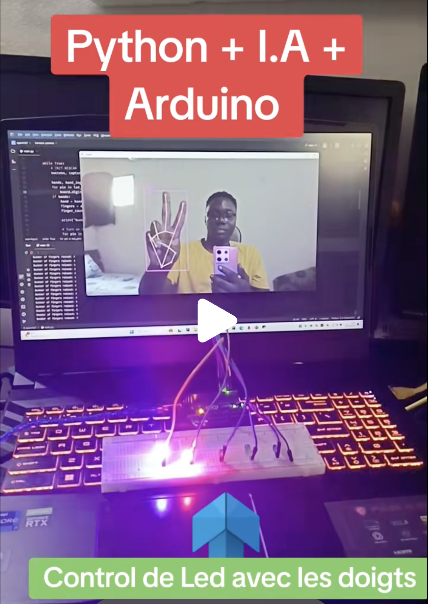

# 👋🔥 Contrôle LED par Détection de Doigts - Arduino & Python

Un projet innovant qui combine **Arduino** et **PyFirmata (Python)** pour contrôler l'allumage de LEDs en fonction du nombre de doigts levés détectés par une caméra.

## 📱 Démonstration Vidéo

[](https://www.tiktok.com/@troizi225/video/7313330736122072326)



## ✨ Fonctionnalités

- 📹 **Détection en temps réel** des doigts levés via webcam
- 💡 **Contrôle LEDs** - Allumage selon le nombre de doigts (1-5 doigts = 1-5 LEDs)
- 🔆 **Contrôle de luminosité** - Ajustement de l'intensité des LEDs
- 🎯 **Interface visuelle** - Affichage en temps réel de la détection
- ⚡ **Communication série** entre Python et Arduino
- 🤖 **Intelligence artificielle** pour la reconnaissance gestuelle

## 🛠️ Technologies Utilisées

- **Arduino UNO** - Microcontrôleur pour contrôler les LEDs
- **Python** - Traitement d'image et détection de doigts
- **OpenCV** - Vision par ordinateur
- **CVZone** - Détection de mains simplifiée
- **PyFirmata** - Communication Python-Arduino
- **NumPy** - Calculs numériques

## 📦 Dépendances Python

```txt
comtypes==1.2.0              # Interfaces COM Windows
cvzone==1.6.1                # Détection de mains et gestes
numpy==1.26.4                # Calculs mathématiques
opencv_contrib_python==4.8.1.78  # Modules OpenCV étendus
opencv_python==4.8.1.78     # Vision par ordinateur
pycaw==20230407              # Contrôle audio Windows
pyFirmata==1.1.0             # Communication Arduino-Python
```

## 🏗️ Structure du Projet

```
finger-led-control/
├── README.md                        # Documentation du projet
├── finger_led_control.py           # Script principal de contrôle
├── finger_led_brightness_control.py # Contrôle avec luminosité variable
├── requirements.txt                 # Dépendances Python
└── arduino/
    └── StandardFirmata.ino         # Code Arduino (Firmata)
```

## 🔌 Matériel Requis

### Composants Électroniques
- **1x Arduino UNO** (ou compatible)
- **5x LEDs** (couleur au choix)
- **5x Résistances 220Ω** (pour les LEDs)
- **Breadboard** ou plaque d'essai
- **Fils de connexion** (jumper wires)
- **Câble USB** (Arduino vers ordinateur)

### Équipements
- **Webcam** ou caméra intégrée
- **Ordinateur** avec Python 3.7+
- **Port USB** disponible

## ⚡ Installation et Configuration

### 1. Configuration Arduino

#### Installer Arduino IDE
1. Télécharger [Arduino IDE](https://www.arduino.cc/en/software)
2. Installer et lancer l'IDE

#### Charger StandardFirmata
1. **Ouvrir Arduino IDE**
2. **Aller dans** : `Fichier` > `Exemples` > `Firmata` > `StandardFirmata`
3. **Sélectionner la carte** : `Outils` > `Type de carte` > `Arduino UNO`
4. **Sélectionner le port** : `Outils` > `Port` > (votre port COM)
5. **Téléverser le code** : Cliquer sur ➡️ (Upload)

### 2. Câblage des LEDs

```
Arduino UNO    Breadboard
├── Pin 2  ──► LED 1 (+ Résistance 220Ω) ──► GND
├── Pin 3  ──► LED 2 (+ Résistance 220Ω) ──► GND
├── Pin 4  ──► LED 3 (+ Résistance 220Ω) ──► GND
├── Pin 5  ──► LED 4 (+ Résistance 220Ω) ──► GND
└── Pin 6  ──► LED 5 (+ Résistance 220Ω) ──► GND
```

#### Schéma de Connexion
```
    Arduino UNO
    ┌─────────────┐
    │      Pin 2  │──[220Ω]──(LED1)──┐
    │      Pin 3  │──[220Ω]──(LED2)──┤
    │      Pin 4  │──[220Ω]──(LED3)──┼── GND
    │      Pin 5  │──[220Ω]──(LED4)──┤
    │      Pin 6  │──[220Ω]──(LED5)──┘
    │         GND │─────────────────────┘
    └─────────────┘
```

### 3. Installation Python

#### Cloner le Projet
```bash
git clone https://github.com/votre-username/finger-led-control.git
cd finger-led-control
```

#### Créer un Environnement Virtuel
```bash
# Créer l'environnement virtuel
python -m venv finger_led_env

# Activer l'environnement (Windows)
finger_led_env\Scripts\activate

# Activer l'environnement (Linux/Mac)
source finger_led_env/bin/activate
```

#### Installer les Dépendances
```bash
pip install -r requirements.txt
```

## 🚀 Utilisation

### 1. Vérification de la Connexion Arduino

```python
# Test rapide de connexion
import pyfirmata
import time

# Remplacez 'COM3' par votre port Arduino
board = pyfirmata.Arduino('COM3')
print("Arduino connecté avec succès!")

# Test LED
board.digital[2].write(1)  # Allumer LED
time.sleep(2)
board.digital[2].write(0)  # Éteindre LED
```

### 2. Lancer le Contrôle Basic

```bash
python finger_led_control.py
```

**Fonctionnalités :**
- 👆 **1 doigt** = 1 LED allumée
- ✌️ **2 doigts** = 2 LEDs allumées
- 🤟 **3 doigts** = 3 LEDs allumées
- 🖖 **4 doigts** = 4 LEDs allumées
- ✋ **5 doigts** = 5 LEDs allumées

### 3. Lancer le Contrôle avec Luminosité

```bash
python finger_led_brightness_control.py
```

**Fonctionnalités avancées :**
- 🔆 **Luminosité variable** selon la distance de la main
- 📊 **Affichage en temps réel** des valeurs
- 🎛️ **Contrôle PWM** des LEDs

## 💻 Code Principal

### finger_led_control.py
```python
import cv2
import cvzone
from cvzone.HandTrackingModule import HandDetector
import pyfirmata
import time

# Configuration Arduino
board = pyfirmata.Arduino('COM3')  # Modifiez le port selon votre système
time.sleep(2)  # Attendre la connexion

# Configuration LEDs (pins 2-6)
led_pins = [2, 3, 4, 5, 6]
leds = [board.get_pin(f'd:{pin}:o') for pin in led_pins]

# Configuration caméra
cap = cv2.VideoCapture(0)
detector = HandDetector(detectionCon=0.8, maxHands=1)

while True:
    success, img = cap.read()
    hands, img = detector.findHands(img)
    
    # Éteindre toutes les LEDs par défaut
    for led in leds:
        led.write(0)
    
    if hands:
        hand = hands[0]
        fingers = detector.fingersUp(hand)
        finger_count = fingers.count(1)
        
        # Allumer les LEDs selon le nombre de doigts
        for i in range(finger_count):
            leds[i].write(1)
        
        # Affichage
        cv2.putText(img, f'Doigts: {finger_count}', 
                   (50, 50), cv2.FONT_HERSHEY_SIMPLEX, 
                   1, (0, 255, 0), 2)
    
    cv2.imshow("Contrôle LED par Doigts", img)
    
    if cv2.waitKey(1) & 0xFF == ord('q'):
        break

cap.release()
cv2.destroyAllWindows()
board.exit()
```

## 🎮 Contrôles

| Geste | Action |
|-------|--------|
| 👆 **1 doigt** | Allume 1 LED |
| ✌️ **2 doigts** | Allume 2 LEDs |
| 🤟 **3 doigts** | Allume 3 LEDs |
| 🖖 **4 doigts** | Allume 4 LEDs |
| ✋ **5 doigts** | Allume 5 LEDs |
| ✊ **Poing fermé** | Éteint toutes les LEDs |
| **Q** (clavier) | Quitter l'application |

## 🔧 Configuration Avancée

### Modifier le Port Arduino
```python
# Windows
board = pyfirmata.Arduino('COM3')

# Linux/Mac
board = pyfirmata.Arduino('/dev/ttyUSB0')
```

### Ajuster la Sensibilité de Détection
```python
detector = HandDetector(
    detectionCon=0.8,    # Confiance de détection (0.5-1.0)
    maxHands=1           # Nombre maximum de mains
)
```

### Personnaliser les Pins LED
```python
led_pins = [2, 3, 4, 5, 6]  # Modifier selon votre câblage
```

## 🔍 Dépannage

### Problèmes Courants

**Arduino non détecté :**
```bash
# Vérifier les ports disponibles
import serial.tools.list_ports
ports = serial.tools.list_ports.comports()
for port in ports:
    print(port.device)
```

**Caméra ne fonctionne pas :**
```python
# Tester différents indices de caméra
cap = cv2.VideoCapture(0)  # Essayer 0, 1, 2...
```

**LEDs ne s'allument pas :**
- Vérifier le câblage et les résistances
- Confirmer que StandardFirmata est bien chargé
- Tester manuellement une LED :
```python
board.digital[2].write(1)  # Devrait allumer la LED
```

**Erreur d'importation :**
```bash
# Réinstaller les dépendances
pip uninstall opencv-python opencv-contrib-python
pip install opencv-contrib-python==4.8.1.78
```

### Messages d'Erreur

**"Could not open port"** :
- Arduino déjà utilisé par un autre programme
- Port incorrect dans le code
- Redémarrer l'Arduino et l'ordinateur

**"No module named 'cv2'"** :
```bash
pip install opencv-contrib-python
```

**"Hand detection not working"** :
- Améliorer l'éclairage
- Positionner la main à 30-60cm de la caméra
- Fond uniforme recommandé

## 📈 Améliorations Possibles

- [ ] **Support multi-mains** - Détection de plusieurs mains
- [ ] **Effets lumineux** - Patterns clignotants et animations
- [ ] **Contrôle vocal** - Commandes vocales en plus des gestes
- [ ] **Interface web** - Contrôle via navigateur
- [ ] **Sauvegarde patterns** - Enregistrer des séquences LED
- [ ] **RGB LEDs** - Contrôle des couleurs
- [ ] **Machine learning** - Reconnaissance de gestes personnalisés
- [ ] **Multi-Arduino** - Contrôle de plusieurs cartes

## 🧪 Extensions

### Contrôle de Servomoteurs
```python
# Ajouter des servos
servo_pin = board.get_pin('d:9:s')
servo_pin.write(angle)  # 0-180 degrés
```

### Capteurs Additionnels
```python
# Capteur ultrasonique
trigger = board.get_pin('d:7:o')
echo = board.get_pin('d:8:i')
```

### Interface GUI
```python
import tkinter as tk
# Créer une interface graphique pour le contrôle
```

## 🤝 Contribution

Les contributions sont les bienvenues ! Voici comment contribuer :

1. **Fork** le projet
2. **Créer une branche** (`git checkout -b feature/nouvelle-fonctionnalite`)
3. **Commit** vos changements (`git commit -m 'Ajout nouvelle fonctionnalité'`)
4. **Push** vers la branche (`git push origin feature/nouvelle-fonctionnalite`)
5. **Créer une Pull Request**

### Idées de Contribution
- Nouvelles détections de gestes
- Optimisation des performances
- Support d'autres microcontrôleurs
- Documentation améliorée
- Tests unitaires

## 📄 Licence

Ce projet est sous licence MIT. Voir le fichier [LICENSE](LICENSE) pour plus de détails.

## 👨‍💻 Auteur

- **TikTok**: [@troizi225](https://www.tiktok.com/@troizi225)
- **GitHub**: [@votre-username](https://github.com/votre-username)
- **Email**: votre.email@example.com

## 🙏 Remerciements

- [CVZone](https://github.com/cvzone/cvzone) pour la détection de mains simplifiée
- [OpenCV](https://opencv.org/) pour les outils de vision par ordinateur
- [PyFirmata](https://github.com/tino/pyFirmata) pour la communication Arduino
- Communauté Arduino pour les ressources et exemples
- Communauté Python pour les bibliothèques de vision

## 📚 Ressources Supplémentaires

- [Documentation Arduino](https://www.arduino.cc/reference/en/)
- [Guide OpenCV Python](https://docs.opencv.org/4.x/d6/d00/tutorial_py_root.html)
- [Tutoriel PyFirmata](https://pypi.org/project/pyFirmata/)
- [CVZone Documentation](https://github.com/cvzone/cvzone)

---

**Développé avec ❤️, Python et Arduino** 🤖💡
